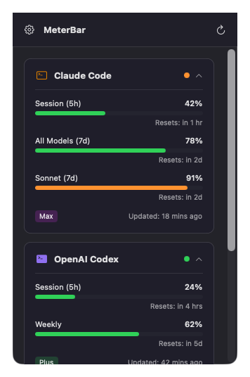
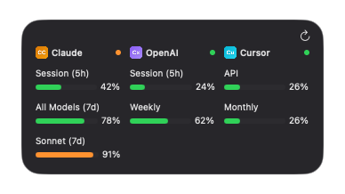

<p align="center">
  
</p>

<h1 align="center">MeterBar</h1>

<p align="center">
  <strong>Track your AI coding assistant usage limits from the menu bar</strong>
</p>

<p align="center">
  
  
  
  
</p>

<p align="center">
  
</p>

---

> **Note**: MeterBar is currently in active development. The app is not yet available on the Mac App Store but will be published soon. For now, you can build from source or download pre-built binaries from the Releases page.

A lightweight macOS menu bar app that monitors Claude Code, Codex CLI, and Cursor usage at a glance.

## Screenshots

<p align="center">
  
  &nbsp;&nbsp;&nbsp;
  
</p>

## Features

- **Menu Bar App**: Quick access to usage data from your menu bar
- **Widget Support**: macOS widget for at-a-glance monitoring
- **Multi-Service Support**: Track Claude Code, Codex CLI, and Cursor
- **Local-First Auth**: Reads credentials from CLI tool config files (no API keys needed). \
    Claude Code on macOS requires a one-click **Check Again** in the popover the first time. After that, MeterBar reads from `~/.claude/.credentials.json` on every refresh and only touches the Keychain again when the file's access token is about to expire — silently picking up rotated tokens written by the `claude` CLI (the *Always Allow* grant from the initial click covers it).
- **Real-time Updates**: Background refresh every 15 minutes by default (configurable in Settings → Refresh)
- **Multi-Expand UI**: Service rows expand independently and the choice persists across launches
- **Color-coded Status**: Green (good), Orange (warning), Red (critical)

## Supported Services

| Service | Auth Method | Metrics Tracked |
|---------|-------------|-----------------|
| **Claude Code** | OAuth token from `claude login` | 5h session, 7-day all models, 7-day Sonnet |
| **Codex CLI** | OAuth token from `codex login` | 5h limit, weekly limit, code review |
| **Cursor** | Local SQLite (for auth) + Cursor API | API usage, On-Demand (if enabled), Monthly limit |

## Installation

### Homebrew (Recommended)

```bash
brew tap shipshitdev/tap
brew install --cask meterbar
```

To update:
```bash
brew upgrade --cask meterbar
```

### Manual Download

Download the latest release from the [Releases](https://github.com/shipshitdev/meterbar.app/releases) page.

> **Note**: Since the app isn't notarized, you may need to right-click and select "Open" the first time, or run:
> ```bash
> xattr -cr /Applications/MeterBar.app
> ```

### Build from Source

Prerequisites: macOS 13.0+, Xcode 15.0+

```bash
git clone https://github.com/shipshitdev/meterbar.app.git
cd meterbar.app
open MeterBar.xcodeproj
# Build and run (Cmd+R)
```

If you're forking, run `./scripts/personalize-signing.sh --team YOUR_TEAM_ID --bundle com.you.meterbar` first — it rewrites `DEVELOPMENT_TEAM`, `PRODUCT_BUNDLE_IDENTIFIER` (app + widget), and the App Group identifier across the project so the build picks up your own Apple Developer signing identity.

## Setup

### Claude Code

1. Install Claude Code CLI: `npm install -g @anthropic-ai/claude-code`
2. Log in: `claude login`
3. In MeterBar, expand the **Claude Code** row and click **Check Again**. The first click triggers macOS's one-time consent prompt for the `Claude Code-credentials` keychain item — pick **Always Allow**. MeterBar copies the OAuth blob into `~/.claude/.credentials.json` (mode `600`) and reads from that file on every refresh thereafter.

> After the initial Check Again, MeterBar reads the file copy on every refresh. When the access token gets close to expiry it silently re-reads the Keychain to pick up the new pair the `claude` CLI just wrote — no second prompt as long as you picked *Always Allow*. The section only falls back to *Not Connected* if `claude` hasn't been used recently enough to refresh the Keychain copy either; click Check Again (or just run `claude` once) to recover. On Linux / non-keychain Claude Code installs, `~/.claude/.credentials.json` already exists and the first click is a plain file read.

### Codex CLI

1. Install Codex CLI: `npm install -g @openai/codex`
2. Log in: `codex login`
3. Select your team/workspace when prompted
4. The app automatically reads credentials from `~/.codex/auth.json`

### Cursor

1. Install and log into Cursor IDE
2. The app automatically reads from Cursor's local database

## Usage

1. **Launch the app** - It appears in your menu bar
2. **Click the icon** - See all your usage metrics
3. **Click a card header** - Expand/collapse to see details
4. **Refresh** - Click the refresh icon to update metrics

### Understanding the Display

**Collapsed view**: Shows service name + compact progress bar for quick status

**Expanded view**: Shows detailed metrics:
- Usage percentage and progress bar
- Reset time (when limits refresh)
- Subscription type badge

### Status Colors

| Color | Meaning |
|-------|---------|
| Green  | < 80% used — plenty of headroom |
| Orange | 80-99% used — approaching limit |
| Red    | ≥ 100% used — at or over the limit |

## CLI Tool

MeterBar includes a command-line tool for scripts and automation.

```bash
# Show current usage
meterbar usage

# JSON output for scripts
meterbar usage --json

# Filter by provider
meterbar usage --provider claude

# Show token costs (last 30 days)
meterbar cost

# Cost for specific period
meterbar cost --days 7 --json
```

The CLI is automatically installed and put on your `PATH` when using Homebrew. For source builds, the binary is produced by SwiftPM at `MeterBarCLI/.build/debug/meterbar` (or `.build/release/meterbar` for a release build); add that directory to your `PATH` or copy the binary somewhere on it.

## How It Works

MeterBar reads authentication tokens from local files created by CLI tools:

```
~/.claude/.credentials.json            # Claude Code OAuth (also reads .claude.json metadata
                                       # and ANTHROPIC_AUTH_TOKEN from settings.json)
~/.codex/auth.json                     # Codex CLI OAuth
~/Library/Application Support/Cursor/  # Cursor local DB
```

It then calls the respective APIs to fetch current usage data:
- Claude Code: `https://api.anthropic.com/api/oauth/usage`
- Codex: `https://chatgpt.com/backend-api/wham/usage`
- Cursor: `https://cursor.com/api/usage-summary` (auth token sourced from the local SQLite DB)

**No API keys are stored** - the app uses the same OAuth tokens as the CLI tools.

## Privacy & Security

- All credentials remain in their original locations (managed by CLI tools)
- No data sent to external servers (only official API calls)
- Sandboxed app with minimal file system access
- Open source for full transparency

## Architecture

- **SwiftUI** - Modern declarative UI
- **Combine** - Reactive data flow
- **App Sandbox** - Secure with specific entitlements for credential access
- **URLSession** - Native networking

## Troubleshooting

### "Not configured" for a service

Make sure you're logged into the CLI tool:
```bash
claude login   # For Claude Code
codex login    # For Codex CLI
```

### Claude Code shows "Not Connected" after `claude login`

On macOS, Claude Code stores its OAuth token in the system Keychain by default — there's no `~/.claude/.credentials.json` file for MeterBar to read. Click **Check Again** in the Claude Code row to copy the credentials into the file MeterBar reads (one-time, with a macOS consent prompt — pick *Always Allow*). If you'd rather do it manually:
```bash
security find-generic-password -s "Claude Code-credentials" -w > ~/.claude/.credentials.json
chmod 600 ~/.claude/.credentials.json
```

### Codex showing "Free" instead of Team

Run `codex logout && codex login` and select your team workspace when prompted.

### App can't read credentials

The app needs sandbox exceptions to read CLI credential files. Rebuild from source if using a modified entitlements file.

## Contributing

Contributions welcome! Please open an issue first to discuss changes.

## License

MIT License - see [LICENSE](LICENSE) for details.
